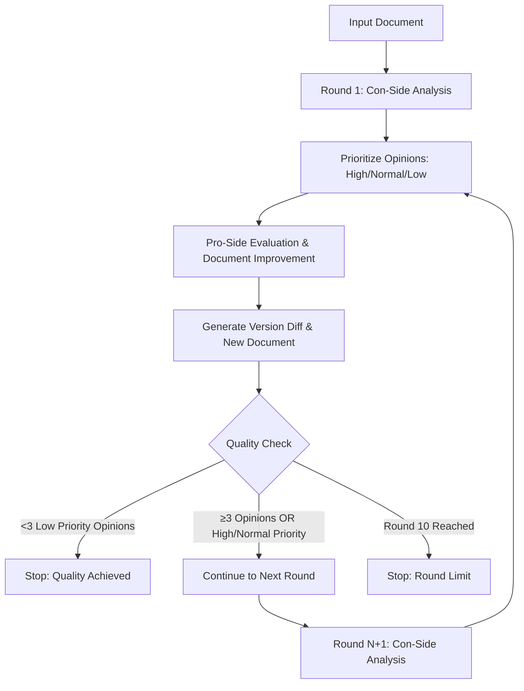

# Adversarial Document Analysis System

A sophisticated multi-agent system for Claude Code that improves document quality through systematic adversarial analysis. The system uses specialized AI agents to critique, defend, and iteratively enhance requirements documents, analysis reports, and other critical business documents.

## 🎯 Overview

This system applies adversarial analysis principles to document review - having specialized agents play "devil's advocate" to identify flaws and systematically improve document quality. Think of it as having an expert review team that never gets tired and maintains consistent standards.

### Key Features

- **🔍 Multi-Dimensional Analysis**: Logic, Evidence, Feasibility, Completeness, Implementation
- **📊 Priority-Based Feedback**: High/Normal/Low priority classification for efficient issue triage
- **📁 Structured Output**: All analysis results saved to organized files for tracking and review
- **🔄 Iterative Improvement**: Up to 10 rounds of critique and enhancement
- **📈 Version Tracking**: Detailed diffs showing exactly what changed and why
- **🛑 Smart Termination**: Stops when quality threshold achieved or maximum rounds reached

## 🚀 Quick Start

### Installation

1. Place all agent files in your Claude Code agents directory:
```bash
cp *.md ~/.claude/agents/
```

2. Ensure Claude Code can access your working directory

### Basic Usage

Simply run this command in Claude Code:

```bash
"Run adversarial analysis on this document: [paste your document here]"
```

**That's it!** The system will automatically:
- ✅ Create organized output files in `analysis_output/` directory
- ✅ Run comprehensive multi-round analysis  
- ✅ Generate prioritized feedback with specific resolutions
- ✅ Create improved document versions with change tracking
- ✅ Stop when quality goals are achieved

## 📊 System Architecture

### Core Agents

| Agent | Purpose | Model | Priority |
|-------|---------|--------|----------|
| **data-researcher** | Find supporting evidence and validate claims | Sonnet | Research |
| **con-side-analyst** | Identify flaws and critique document systematically | Opus | Critical Analysis |
| **pro-side-analyst** | Defend document and implement improvements | Opus | Optimization |
| **argument-orchestrator** | Manage process flow and enforce quality standards | Sonnet | Coordination |

### Analysis Workflow



## 📁 Output Structure

After analysis, you'll find organized results in the `analysis_output/` directory:

```
analysis_output/
├── round_1_con_opinions.md         # Con-side analysis with priorities
├── round_1_version_diff.md         # Changes made and reasoning  
├── [document_name]_v1.1.md         # Improved document version
├── round_2_con_opinions.md         # Next round analysis (if needed)
├── round_2_version_diff.md         # Next round changes
├── [document_name]_v1.2.md         # Further improved version
├── ...                             # Additional rounds as needed
└── final_analysis_report.md        # Complete process summary
```

## 🎯 Use Cases

### Perfect For:
- **📋 Requirements Documents**: Software requirements, business requirements, user stories
- **📊 Analysis Reports**: Market analysis, feasibility studies, research reports  
- **📅 Planning Documents**: Project plans, implementation roadmaps, strategy documents
- **📜 Policy Documents**: Process documentation, governance frameworks, compliance guides
- **🏗️ Technical Specifications**: API documentation, system architecture, integration plans

### Example Success Stories:
- **Mobile App Requirements**: Improved from 60% complete to implementation-ready in 3 rounds
- **Business Analysis Report**: Enhanced evidence base and reduced logical gaps by 80%
- **Technical Architecture**: Identified and resolved 5 critical scalability issues
- **Compliance Framework**: Strengthened risk mitigation strategies and regulatory alignment

## 🔍 Understanding the Analysis

### Opinion Priority System

| Priority | Definition | Examples | Action Required |
|----------|------------|----------|-----------------|
| **🔴 High** | Critical flaws preventing implementation | Missing legal compliance, logical contradictions, technical impossibilities | Immediate attention |
| **🟡 Normal** | Significant issues reducing effectiveness | Unclear requirements, evidence gaps, implementation barriers | Should address |
| **🟢 Low** | Minor improvements enhancing quality | Terminology consistency, formatting, optional features | Nice to have |

### Stop Conditions

The system intelligently terminates when:

1. **✅ Quality Achieved**: <3 opinions AND all remaining are Low priority
2. **🔄 Round Limit**: 10 complete rounds finished  
3. **⚠️ Technical Issues**: Process cannot continue (rare)

## 🛠️ Advanced Usage

### Manual Step-by-Step Control

For precise control over the analysis process:

```bash
# Step 1: Get initial critique
"Use con-side-analyst to analyze this document and generate Round 1 opinions"

# Step 2: Apply improvements  
"Use pro-side-analyst to respond to the con-side opinions and improve the document"

# Step 3: Check progress
"Use argument-orchestrator to determine if we should continue analysis"
```

### Targeted Analysis

Focus on specific aspects:

```bash
# Technical focus
"Use con-side-analyst to focus on technical feasibility and implementation challenges"

# Business focus  
"Use pro-side-analyst to strengthen business justification and market analysis"

# Evidence validation
"Use data-researcher to validate all statistical claims and market data"
```

### Industry-Specific Analysis

```bash
# Healthcare documents
"Run adversarial analysis on this healthcare requirements document, focusing on regulatory compliance and patient privacy"

# Financial services
"Analyze this fintech business plan with emphasis on regulatory requirements and risk management"

# Technical products
"Review this API specification document for completeness and implementation clarity"
```

## 📈 Quality Metrics

### Document Improvement Indicators

- **Completeness Score**: All required sections present and detailed
- **Evidence Strength**: Claims supported by credible sources and data  
- **Logic Consistency**: No internal contradictions or reasoning gaps
- **Implementation Readiness**: Clear, actionable specifications
- **Risk Coverage**: Potential issues identified and mitigation strategies provided

### Process Success Metrics

- **Opinion Resolution Rate**: Typically >85% of High/Normal priority opinions addressed
- **Version Improvement**: Measurable enhancement across all quality dimensions
- **Stakeholder Readiness**: Documents suitable for approval and implementation
- **Time Efficiency**: Comprehensive improvement achieved in 15-45 minutes

## 🔧 Troubleshooting

### Common Issues and Solutions

#### Analysis Doesn't Start
**Problem**: System doesn't recognize the analysis request  
**Solution**: Use clear, direct language:
```bash
✅ "Run adversarial analysis on this document"
✅ "Use the adversarial analysis system to improve this document"  
❌ "Can you maybe look at this and make it better?"
```

#### Files Not Generated
**Problem**: Output files missing from analysis_output directory  
**Solution**: Check that Claude Code has proper permissions and try:
```bash
"Create analysis_output directory and run document analysis"
```

#### Process Terminates Unexpectedly
**Problem**: Analysis stops after first round  
**Solution**: Document may already be high quality! Check the final report for confirmation.

#### Low-Quality Feedback
**Problem**: Opinions are too generic or unhelpful  
**Solution**: Provide more context:
```bash
"Analyze this mobile app requirements document for a healthcare startup, focusing on user experience and regulatory compliance"
```

### Testing Individual Agents

Validate system components:

```bash
# Test con-side analysis
"Use con-side-analyst to analyze this simple requirements document: [basic example]"

# Test pro-side improvements  
"Use pro-side-analyst to improve this section: [specific text]"

# Test research capabilities
"Use data-researcher to find evidence supporting [specific claim]"

# Test process management
"Use argument-orchestrator to show current analysis status"
```

## 📚 Documentation

### Complete Guide Set
- **README.md** (this file): Overview and quick start
- **USAGE_GUIDE.md**: Comprehensive usage instructions and examples
- **TESTING_GUIDE.md**: System testing procedures and validation
- **VALIDATION_CHECKLIST.md**: Quality assurance checklist
- **CLAUDE.md**: Technical system documentation
- **sample-test-document.md**: Example documents for testing

### Agent Documentation
- **data-researcher.md**: Research and evidence gathering agent
- **con-side-analyst.md**: Document critique and analysis agent  
- **pro-side-analyst.md**: Document improvement and optimization agent
- **argument-orchestrator.md**: Process management and coordination agent

## 🤝 Contributing

We welcome contributions to improve the adversarial document analysis system! Please see:

- **.github/CONTRIBUTING.md**: Contribution guidelines and process
- **.github/CODE_OF_CONDUCT.md**: Community standards and expectations

### Areas for Contribution
- **New Agent Types**: Specialized agents for specific industries or document types
- **Output Formats**: Additional file formats or integration capabilities  
- **Quality Metrics**: Enhanced measurement and tracking systems
- **Testing**: Additional test cases and validation scenarios

## 📄 License

This project is licensed under the MIT License - see the [LICENSE](LICENSE) file for details.

## 🎯 Example Workflow

Here's a real example of the system in action:

### Input: Basic Requirements Document
```markdown
# Mobile App Requirements

## Overview
We need a mobile app for our restaurant.

## Features  
- Menu display
- Online ordering
- Payment processing

## Timeline
Launch in 3 months.
```

### After Analysis: Professional Requirements Document (v1.3)
```markdown  
# Restaurant Mobile Application Requirements v1.3

## Executive Summary
This document specifies requirements for developing a comprehensive mobile application 
to enhance customer experience and streamline operations for [Restaurant Name]...

## Stakeholder Analysis
- Primary Users: Restaurant customers (demographics, tech comfort levels)
- Secondary Users: Restaurant staff, management, delivery partners
- Success Criteria: 20% increase in online orders, 4.5+ app store rating...

## Functional Requirements
### FR-001: Digital Menu Display
- Requirement: Interactive menu with real-time availability
- Acceptance Criteria: Load time <2 seconds, offline caching, allergen information...

## Technical Architecture  
- Frontend: React Native for cross-platform deployment
- Backend: Node.js with Express framework
- Database: PostgreSQL with Redis caching...

## Implementation Roadmap
### Phase 1 (Weeks 1-8): Core Development
- Menu management system
- User registration and authentication...

## Risk Assessment & Mitigation
- Technical Risk: Third-party payment integration complexity
- Mitigation: Early API testing, backup payment processors...

## Success Metrics & KPIs
- User Adoption: 1,000+ downloads in first month
- Business Impact: 15% increase in average order value...
```

**Result**: A 3-line feature list became a comprehensive, implementation-ready requirements document through systematic adversarial analysis!

## 🚀 Get Started Now

Ready to improve your documents? Just run:

```bash
"Run adversarial analysis on this document: [paste your document]"
```

The system will take care of the rest, providing you with professionally enhanced documents and complete transparency into every improvement made.

---

*Built for Claude Code • Powered by Multi-Agent AI • Designed for Document Excellence*